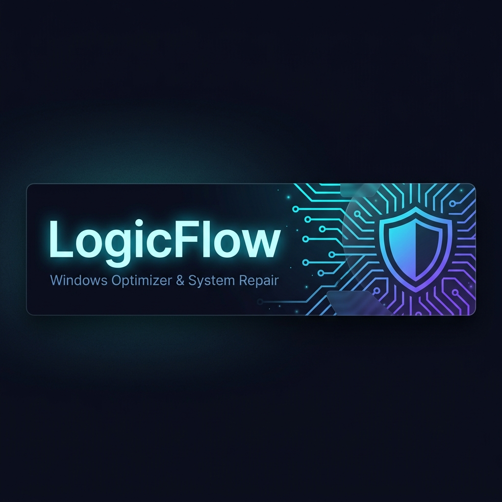

<div align="center">



<br>

# LogicFlow

**The sovereign Windows optimizer — built for performance, privacy, and permanence.**

[](https://github.com/DelgadoLogic/logicflow-core/actions)
[](https://github.com/DelgadoLogic/logicflow-core/releases)
[](Docs/EULA.txt)
[](https://delgadologic.tech/logicflow)

</div>

---

## What It Does

LogicFlow is a 12-module Windows optimization and system repair suite. It finds what slows your machine down, fixes it, and keeps it clean — automatically, silently, and on your schedule.

**No cloud uploads. No telemetry. No subscriptions unless you choose Pro.**

---

## Modules

| Module | Purpose |
|--------|---------|
| **LogicFlow.Core** | Central orchestration engine, system profiler, logging |
| **LogicFlow.Guardian** | Disk cleanup, junk removal, startup optimizer, Windows tweaks |
| **LogicFlow.Lazarus** | System file repair, SFC/DISM automation, recovery |
| **LogicFlow.Sentinel** | Vulnerability scanner, outdated software detection, CVE alerting |
| **LogicFlow.Native** | P/Invoke layer — disk SMART, registry, WMI, Win32 APIs |
| **LogicFlow.Dashboard** | WPF UI, tray icon, system health tiles, auto-update display |
| **LogicFlow.Agent** | Background Windows Service — scheduled scans, auto-updates |
| **LogicFlow.Licensing** | License validation, activation, 30-day offline grace |
| **LogicFlow.Commerce** | Purchase flow integration (Stripe) |
| **LogicFlow.Pulse** | Real-time CPU/RAM/disk performance monitoring |
| **LogicFlow.Registry** | Registry surgery — safe cleanup and repair |
| **LogicFlow.Scraper** | Windows issue harvester — feeds Guardian and Sentinel |

---

## Architecture

```
LogicFlow.Dashboard (WPF UI)
        │
        ├── LogicFlow.Core ← orchestrates everything
        │       ├── LogicFlow.Guardian   (disk + tweaks)
        │       ├── LogicFlow.Lazarus    (repair)
        │       ├── LogicFlow.Sentinel   (security)
        │       ├── LogicFlow.Pulse      (monitoring)
        │       ├── LogicFlow.Registry   (registry)
        │       └── LogicFlow.Scraper    (issue harvest)
        │
        ├── LogicFlow.Agent  (Windows Service — background)
        ├── LogicFlow.Licensing + Commerce
        └── LogicFlow.Native (P/Invoke → Win32)
```

**Sovereign update server** (`https://api.delgadologic.tech`):
All updates are Ed25519-signed. The agent verifies signatures before applying — no unsigned code ever runs.

---

## Build

```powershell
# Requires .NET 8 SDK
git clone https://github.com/DelgadoLogic/logicflow-core.git
cd logicflow-core
dotnet restore
dotnet build --configuration Release
```

### CI/CD
Push to `main` → GitHub Actions → dotnet build + test → publish sovereign manifest on git tag push.

---

## Update Model

LogicFlow.Agent checks the sovereign update server on launch:
1. Fetch `manifest.json` (channel: `logicflow/stable`)
2. Verify Ed25519 signature using embedded public key
3. Download delta during quiet hours (10PM–8AM)
4. Apply silently on next launch — no interruptions

---

## License & Editions

| Edition | Price | Features |
|---------|-------|---------|
| **Free** | $0 | Full diagnostics — see every issue, pay to fix |
| **Community** | $0 + telemetry | Full Pro access in exchange for anonymous system error reports (telemetry opt-in) |
| **LogicFlow Pro** | $29.99 one-time | All 12 modules unlocked, lifetime sovereign updates, offline execution |

See [EULA.txt](Docs/EULA.txt) for full license terms.

---

## Roadmap

- [x] All 12 modules implemented (`v0.1.0-foundation`)
- [x] CI/CD pipeline active (GitHub Actions → sovereign server)
- [x] Sovereign update server integration (`api.delgadologic.tech`)
- [x] GitHub Release for v0.1.0 with installer alpha
- [x] Real-time Dashboard health tiles & visual overhaul
- [x] Auto-updater consuming sovereign manifest
- [x] Settings tab wiring & custom toggle styles
- [x] Deep Uninstaller & Leftover Residual Tracker (`UninstallerEngine.cs`)
- [x] Network & DNS Optimizer Engine (`NetworkOptimizerEngine.cs`)
- [x] Game & High-Performance Mode Engine (`GameModeEngine.cs`)
- [x] PnP Driver Audit & Error Detector (`DriverAuditorEngine.cs`)
- [x] VoiceAgent function dispatcher integration for local AI control
- [x] 58/58 unit test suite verification (`dotnet test --configuration Release`)
- [ ] Stripe payment integration (pending EIN)
- [ ] Windows 7 SP1 compatibility testing

---

<div align="center">

Built by **[DelgadoLogic](https://delgadologic.tech)** · Made for the machines everyone else abandoned

</div>
